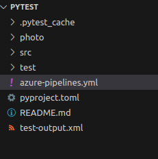

# Short Description About this template

In this techhub we will test the python Test using the ADO pipeline for a simple Python project. Here we are checking the Python test cases and running through the ADO the result of the test cases pass or failed into the  Nunit xml file (test-output.xml)

# Steps for Execution 
1. clone the repository  
2. start the agent to run the pipeline.

As you can see in the below image when we run the Python test cases this will create a test-output.xml 

It is also showing the report and showing how many test cases pass/fail 

